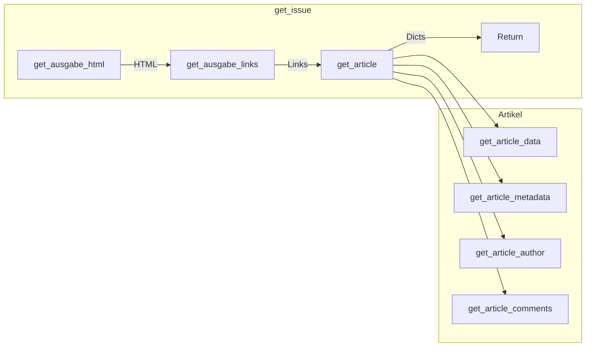

# Zeit Archivierer

Skript zurm Herunterladen des gesamten Zeit Archivs von archiv.zeit.de
Extrahiert verschiedene Metadaten und den Text der Artikel in JSON-Dateien

### Daten über Artikel

- Titel
- Kurzbeschreibing
- Keywords
- Autor (wenn vorhanden)
- Datum (wenn vorhanden)
- Text
- Kommentare
  - UserID und Name
  - Kommentartext
- URL
- ID aus Jahr/Ausgabe/Artikelnummer 

### Daten über Ausgabe

- ID aus "Jahr/Ausgabe"
- Jahr
- Ausgabe
- Anzahl an Artikeln
- Liste an Ressorts
- Zugriffsdatum (ISO)
- Veröffentlichungsdatum (ISO)

### Speicherort

In Ordner `data` jeweils mit Jahr und einem JSON-File pro Ausgabe

bspw. `data/1960/1960-34.json` mit 34 als Kalenderwoche

### Funktion

